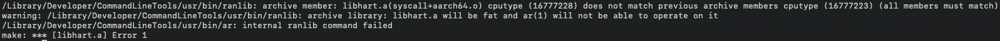

# harec

This is a [Hare](https://harelang.org) compiler written in C11 for
POSIX-compatible systems.

## Build status

<dl>
  <dt>Linux (x86_64)</dt><dd><a href="https://builds.sr.ht/~sircmpwn/harec/commits/master/alpine.yml"></a></dd>
  <dt>FreeBSD (x86_64)</dt><dd><a href="https://builds.sr.ht/~sircmpwn/harec/commits/master/freebsd.yml"></a></dd>
</dl>

## Building

```
make
sudo make install
```

Optionally, build and run the test suite as well:

```
make check
```

## Runtime

harec includes a minimal runtime under `rt` which is suitable for running the
test suite, but not recommended for production use. See `docs/runtime.txt` for
details on how to provide your own runtime implementation, or use the [Hare
standard library](https://git.sr.ht/~sircmpwn/hare).

## Notes on Port

**Status: Generates assembly, compiled assembly does not run. Rosetta2 required for M1.**

**This port doesn't work (yet).**
Specifically, harec-generated assembly compiles but does not run. I am pretty sure (though I don't really know assembly so I am not sure) that this is due to the fact that there are some differences between `FreeBSD` and `macOS` that the assembler does not catch, but the OS doesn't want or know how to run. Right now

**Some other stuff:**

- for whatever reason, I am getting this error on a clean make:
  
  Most of the stuff online seems to relate from the PPC-to-intel transition, with a little bit of M1 stuff in there as well.

- no idea whether this will work on the `BSD`s/`linux`es, since I had to mess with some of the emit code to get it to build properly. I might spin up a couple of VMs in the future to check but for now this port is macOS-only (and I intend to remove the other platform stuff soon)

- running `make check` fails under arm64. It kind of fails under `arch -x86_64 fish` (stuff about `ld` commands that I had solved in the past and I need to re-solve). This is due to the fact that QBE generates x86 asm (i think). 